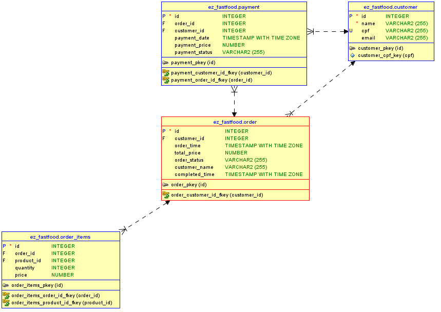

# Infraestrutura de Banco de Dados

## Escolha do Banco de Dados: RDS PostgreSQL

A solução ez-fastfood-api, desenvolvida para uma lanchonete, foi inicialmente estruturada utilizando o banco de dados PostgreSQL devido à sua robustez, ampla adoção no mercado e suporte nativo para modelagem relacional de dados. A escolha de um banco relacional foi motivada pela necessidade de estabelecer relações entre entidades fundamentais da API, como pedidos, clientes e pagamentos, garantindo integridade, consistência e eficiência no gerenciamento dos dados.

Com a evolução do projeto e a necessidade de migração para um ambiente em nuvem, o Amazon RDS (Relational Database Service) com PostgreSQL foi a opção mais adequada por diversas razões:

1. **Facilidade de Migração**:
Por já utilizarmos o PostgreSQL no ambiente local, o Amazon RDS PostgreSQL permitiu uma transição transparente e eficiente para a nuvem. Não houve necessidade de refatoração da aplicação ou reestruturação do banco de dados, preservando a lógica relacional já estabelecida e minimizando o tempo e o esforço envolvidos no processo de migração.

2. **Escalabilidade Vertical e Horizontal**:
O Amazon RDS PostgreSQL oferece escalabilidade vertical e horizontal, permitindo o ajuste de recursos computacionais, como CPU, memória e armazenamento, de forma prática e sob demanda. Isso garante que a API possa lidar com o aumento de requisições sem impacto significativo no desempenho. Se a lanchonete expandir futuramente, o RDS PostgreSQL proporcionará um crescimento sustentável, suportando um maior volume de dados e transações simultâneas.

3. **Desempenho e Confiabilidade**:
O Amazon RDS PostgreSQL é uma solução gerenciada que oferece alta disponibilidade e redundância automática, garantindo que o banco de dados permaneça acessível mesmo em cenários de falhas ou interrupções. Recursos como réplicas de leitura e backups automatizados contribuem para um desempenho otimizado e uma operação segura, essenciais para APIs que exigem resposta rápida e alta confiabilidade.

4. **Gestão simplificada**:
Ao adotar o Amazon RDS, a equipe evita tarefas complexas de gerenciamento, como configuração, aplicação de patches, backups e monitoramento. Com o serviço gerenciado da AWS, o foco pode permanecer no desenvolvimento e na otimização da API, permitindo maior agilidade na entrega de melhorias e novas funcionalidades.

**Considerações Futuras**
Caso a lanchonete venha a expandir, o Amazon RDS PostgreSQL continuará sendo uma solução robusta e escalável. Ele poderá suportar tanto o crescimento do volume de dados quanto o aumento das transações simultâneas, mantendo a integridade e desempenho do sistema sem necessidade de migrações ou mudanças significativas na arquitetura.

## Pré-requisitos (execução via pipeline)
1. Terraform
2. Credenciais AWS: Configure as credenciais AWS para permitir o provisionamento de recursos.
No pipeline configurado no GitHub Actions, as credenciais foram armazenadas como secret variables para evitar exposição direta no código:

- **AWS_ACCESS_KEY_ID**
- **AWS_SECRET_ACCESS_KEY**

## Modelagem de Dados
O banco de dados foi modelado com base nos requisitos do negócio, priorizando o uso de relacionamentos fortes entre tabelas. O diagrama abaixo representa o modelo de dados, incluindo entidades como **Pedidos**, **Pagamentos** e **Clientes**.

---

## Links dos demais repositórios deste projeto:
- Network: https://github.com/ThaynaraDaSilva/ez-fastfood-network
- APIs: https://github.com/ThaynaraDaSilva/ez-fastfood-api
- EKS:https://github.com/ThaynaraDaSilva/ez-fastfood-eks
- Lambda: https://github.com/ThaynaraDaSilva/ez-fastfood-authentication

## Desenvolvido por:
@tchfer : RM357414
@ThaynaraDaSilva : RM357418